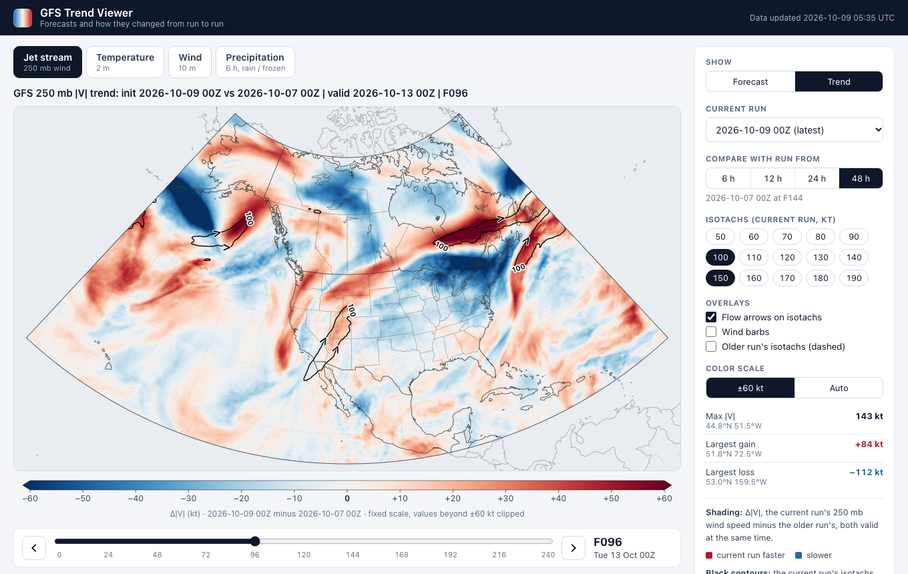
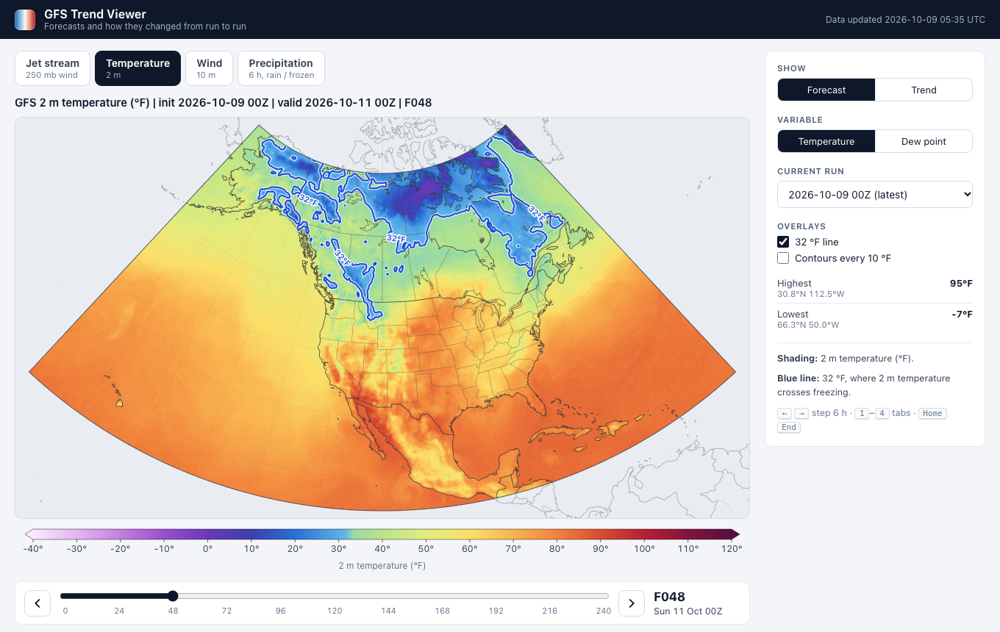
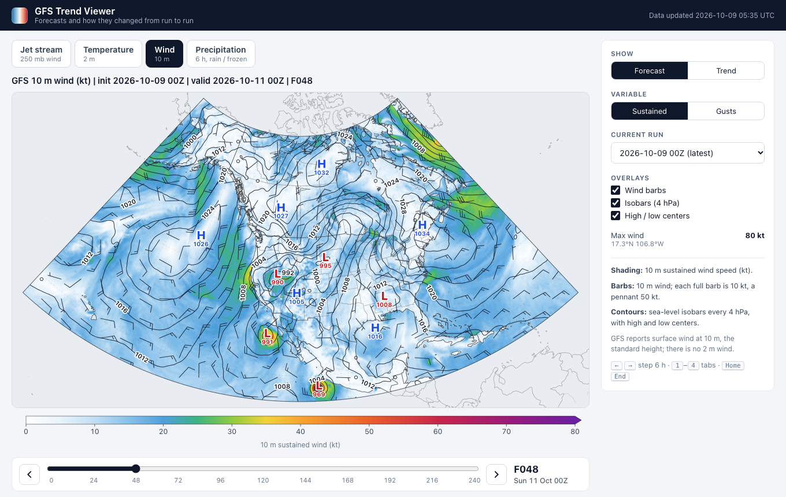
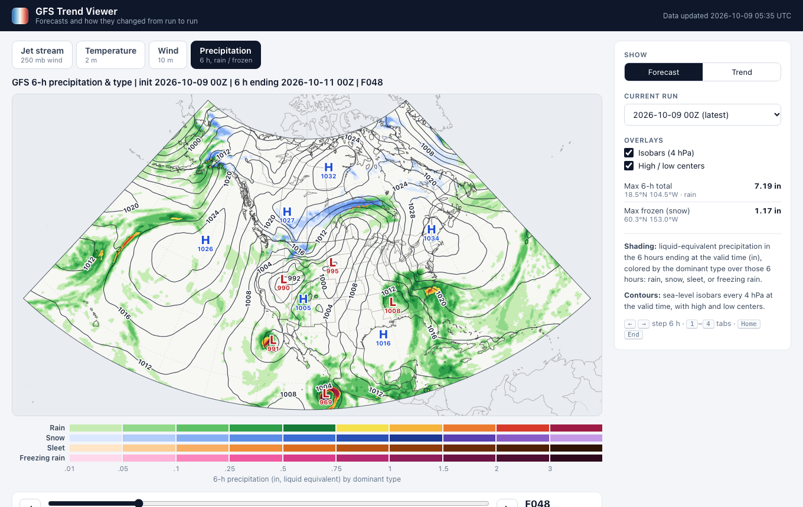

# GFS Trend Viewer

An in-browser viewer for **GFS forecasts and how they have changed between model runs**. It
started as a 250 mb wind-speed version of the Tropical Tidbits "trend" overlays. It now has four
tabs, each with a **Forecast** and a **Trend** mode.



| Temperature | Wind | Precipitation |
|---|---|---|
|  |  |  |

| Tab | Forecast | Trend (current − older run, same valid time) | Overlays |
|---|---|---|---|
| **Jet stream** (250 mb) | wind speed (kt) | Δ\|V\|: red faster, blue slower | isotachs 50–190 kt with flow arrows, wind barbs, the older run's isotachs (dashed violet) |
| **Temperature** (2 m) | temperature or dew point (°F) | Δ: red warmer, blue colder | 32 °F line, 10 °F contours, the older run's 32 °F line |
| **Wind** (10 m) | sustained wind or gusts (kt) | Δ: red windier, blue calmer | wind barbs, isobars every 4 hPa, H/L centers |
| **Precipitation** | 6-hour total by dominant type: rain, snow, sleet, freezing rain | Δ 6-h total: green wetter, brown drier | isobars, H/L centers |

In trend mode the shading is, for example,

> Δ|V| = |V|(current run) − |V|(older run), both valid at the same time

and the same rule applies to every tab. The jet tab opens in trend mode; the others open in
forecast mode. GFS reports surface wind at 10 m, the standard height. There is no 2 m wind.

Once GitHub Pages is set up (see [below](#github-pages-and-actions-setup)), the site is published at
**https://christopherward13.github.io/Weather-Data-Viz/**.

## How the comparison lines up

For a current run initialized at **T0** and viewed at forecast hour **f**, the valid time is
**T0 + f**. With lag **L**, the comparison frame is the run initialized at **T0 − L**, at forecast hour
**f + L**, which is valid at the same instant. For example, at the default 48 h lag:

| Current run | Hour | Valid | Compared with | Hour |
|---|---|---|---|---|
| 2026-10-08 18Z | F000 | 2026-10-08 18Z | 2026-10-06 18Z | F048 |
| 2026-10-08 18Z | F240 | 2026-10-18 18Z | 2026-10-06 18Z | F288 |

That second row is why every run is fetched out to **F288** (`fhr_max + max lag`) even though only
F000–F240 are displayed. If the older run or the needed hour isn't available, the map shows a
**"comparison unavailable"** state naming exactly what is missing. It never falls back to another
lag. Precipitation is a 6-hour total, so it starts at F006, and F000 says so.

## Repository layout

```
config.json            every parameter: model, domain, hours, lags, fields and their encodings, views
pipeline/              Python pipeline (uv): Herbie + cfgrib → compact frames + manifest.json
  src/wxtrend/         alignment, fields, catalog (GRIB → bands), cycles, fetch, store, manifest, update, cli
  schema/              JSON Schema for manifest.json
  tests/               pytest
web/                   static frontend (Vite + TypeScript + d3)
  src/views/           one module per tab: what to load, how to shade, overlays, stats, readout
  src/                 map rendering, contours, barbs, pressure centers, palettes, frame loading
  scripts/             one-off Natural Earth → TopoJSON basemap builder
  tests/               vitest unit tests
  e2e/                 Playwright tests against the production build and real data
shared/test-vectors/   alignment, Δ, and frame-encoding cases checked by BOTH pytest and vitest
docs/                  screenshots and adding-a-field.md (how to add the next data type)
.github/workflows/     update.yml (cron → pipeline → deploy), ci.yml (tests on push/PR)
data/                  pipeline output (git-ignored)
```

Adding another field (500 mb height, CAPE, …) is a short recipe:
**[docs/adding-a-field.md](docs/adding-a-field.md)**, which also collects the GRIB, storage, and
rendering gotchas.

## Local setup

Prerequisites (all free): [uv](https://docs.astral.sh/uv/) (`brew install uv`) and Node.js 22+.
uv installs a suitable Python (3.11+) on its own, and the `eccodes` wheel bundles the ecCodes
library, so nothing else needs to be installed.

```bash
make setup
```

```bash
make dev
```

`make dev` processes the latest complete GFS cycle plus the older runs needed for the longest lag
(9 runs × 49 hours × 9 fields, about 2.9 GB of byte ranges and 7–8 minutes the first time), then
serves the site at http://localhost:5173. Later runs only fetch what's new. `make dev QUICK=1`
fetches just the 5 runs the newest one is compared against. If the fetch fails (for example when
offline) but data already exists, the site is served anyway.

Other targets:

| Command | What it does |
|---|---|
| `make data` | Run the pipeline once (`wxtrend update`) |
| `make test` | pytest + vitest |
| `make e2e` | Build, serve, and run the Playwright tests against `data/` (also writes the screenshots) |
| `make build` | Build the static site with data into `web/dist/` |
| `make verify` | Validate `manifest.json` against the schema and check every frame's size |

### Pipeline CLI

```bash
cd pipeline
uv run wxtrend update                        # latest complete cycle + retention window; no-op if done
uv run wxtrend update --cycle 2026100818     # treat a specific cycle as latest
uv run wxtrend fetch --cycle latest --hours 0 --data-dir /tmp/dry       # one-hour dry run, all fields
uv run wxtrend fetch --cycle latest --hours 0-24 --fields t2m,mslp      # selected fields
uv run wxtrend verify                        # schema + frame sizes
uv run wxtrend inspect --fhr 120 --lag 48 --field t2m --band temp       # Δ statistics for one pair
```

**Latest complete cycle:** `update` steps back from the current 6-hourly cycle. It sends HEAD
requests for the `.idx` file of every forecast hour it needs (F000–F288) on
`noaa-gfs-bdp-pds`, checking the last hour first. The first cycle with all of them published is
used.

**Fetching:** for each (run, hour) with any missing field, one Herbie download fetches only the
matching GRIB messages, using HTTP range requests from the `.idx` inventory (about 6.5 MB per hour
for all fields). Each field is then computed, encoded, and gzipped in a pool of worker processes,
with retries.

**Pruning and the manifest:** runs outside the window are deleted, and the manifest is rebuilt from
what is on disk. When a field is added to `config.json`, the next update fetches just that field for
every retained run.

## GitHub Pages and Actions setup

Do these once in the repository on GitHub:

1. **Settings → Pages → Build and deployment → Source:** choose **GitHub Actions**.
2. **Settings → Actions → General:** make sure Actions are allowed. The workflows declare their own
   permissions, so the default read-only token setting is fine.
3. **Actions → "Update data and deploy" → Run workflow**, with **force_deploy** checked, for the
   first deploy. The first run has no cache, so it backfills all 9 runs (about 10 minutes).
4. That's it. The schedule then takes over.

What the workflow does (`.github/workflows/update.yml`):

- **Schedule:** it runs at `05:05, 11:05, 17:05, 23:05 UTC`, about T0 + 5:05 for the 00/06/12/18Z
  cycles. A retry runs at T0 + 5:50. On 2026-10-08, F240 reached AWS at about T0 + 4:40 and F288 at
  about T0 + 4:52, so a run at T0 + 4:30 would always find the cycle incomplete. The retry is a cheap
  no-op when the first run already succeeded. GitHub's cron often starts late, which only adds
  margin.
- **Persistence:** processed runs (about 160 MB) are kept between workflow runs with
  `actions/cache`. Each save gets a unique key (`gfs-data-<run_id>-<attempt>`), the restore takes
  the newest one by prefix, and older entries are deleted after a save. Each cycle therefore
  downloads only the new run. Correctness doesn't depend on the cache: if GitHub evicts it, the
  pipeline backfills the missing runs from AWS. Data is never committed to git.
- **Build and deploy:** it builds `web/`, runs the Playwright tests against the new data, then copies
  `data/` into the site and deploys it with `actions/deploy-pages`. When nothing changed, it skips
  the cache save, build, and deploy.

Things to know:

- GitHub **disables scheduled workflows in public repositories after 60 days without repository
  activity**. If updates stop, re-enable the workflow from the Actions tab (or push any commit).
- To force a full refetch, delete the `gfs-data-*` entries under **Actions → Caches**.
- `ci.yml` runs pytest, vitest, and a production build on pushes to `main` and on pull requests.

## Data format (schema 2)

Everything the site reads lives under `data/` (served at `<site>/data/`).

### Frames: `runs/<YYYYMMDDHH>/<field>/f<FFF>.bin.gz`

- **Fields:** one file per (run, field, hour). A field is a group of **bands**, stored back to back
  in config order. Most fields have one band; precipitation has two (amount and type).
- **Band layout:** each band is `ny × nx` samples, row-major. **Row 0 is the northern edge (70°N)**
  and rows go south; columns go west (170°W) to east (50°W). `uint16` samples are little-endian.
- **Row-delta filter:** each row stores its first sample, then the difference from the previous
  sample modulo 2^bits. Decoding is a running sum per row. This makes gzip about 20% smaller.
- **Values:** `value = stored × scale + offset`, in the band's `units`. Values are rounded to the
  nearest step and clipped to the dtype's range. Wrapped bands (directions, `wrap: 360`) are stored
  modulo instead. There is no missing-value sentinel; the pipeline refuses to encode NaNs.
- **Compression:** gzip. The browser decompresses with `DecompressionStream('gzip')`, and passes
  bytes through if a server already removed the gzip layer.

| Field | Bands | Encoding |
|---|---|---|
| `wspd250` | speed | uint8, 1 kt |
| `wdir250` | dir (from) | uint8, 360/256°, wraps |
| `t2m` | temp | uint8, 1 °F, offset −80 |
| `d2m` | dewpt | uint8, 1 °F, offset −80 |
| `wspd10` | speed | uint8, 1 kt |
| `wdir10` | dir (from) | uint8, 360/256°, wraps |
| `gust` | gust | uint8, 1 kt |
| `mslp` | mslp (MSLET) | uint16, 0.1 hPa |
| `precip` | qpf (6-h total, liquid equivalent); ptype (0 none, 1 rain, 2 snow, 3 sleet, 4 freezing rain) | uint16, 0.01 in; uint8 category |

Precipitation type is the dominant type over the same 6 hours as the total. It comes from GFS's
6-hour-averaged categorical fields; ties go to the more impactful type.

### `manifest.json`

The manifest is validated against `pipeline/schema/manifest.schema.json` and built from the files
actually on disk, so it never lists a frame that doesn't exist. Runs are listed newest first.

```json
{
  "schema_version": 2,
  "generated_at": "2026-10-09T05:35:00Z",
  "model": { "name": "gfs", "product": "pgrb2.0p25" },
  "grid": { "nx": 481, "ny": 221, "lon0": -170.0, "lat0": 70.0, "dlon": 0.25, "dlat": -0.25,
            "row_order": "north_to_south", "col_order": "west_to_east",
            "lat_min": 15.0, "lat_max": 70.0, "lon_min": -170.0, "lon_max": -50.0 },
  "compression": "gzip",
  "layout": "bands_concatenated_row_major_little_endian",
  "filter": "row_delta",
  "fields": {
    "t2m": { "label": "2 m temperature", "min_fhr": 0, "frame_bytes": 106301,
             "bands": [{ "name": "temp", "units": "F", "dtype": "uint8", "scale": 1.0, "offset": -80.0 }] },
    "precip": { "label": "6-hour precipitation and type", "min_fhr": 6, "frame_bytes": 318903, "bands": ["…"] }
  },
  "path_template": "runs/{run}/{field}/f{fhr:03d}.bin.gz",
  "cycle_interval_hours": 6,
  "display_hours": [0, 6, "…", 240],
  "latest": "2026100900",
  "runs": [
    { "id": "2026100900", "init": "2026-10-09T00:00:00Z",
      "hours": { "wspd250": [0, 6, "…", 288], "precip": [6, 12, "…", 288], "…": [] }, "complete": true }
  ]
}
```

`complete` is `false` when some (field, hour) failed to fetch; those are retried on the next run.

Reading a frame in Python:

```python
import gzip, json, numpy as np
m = json.load(open("data/manifest.json"))
g, f = m["grid"], m["fields"]["t2m"]
raw = gzip.decompress(open("data/runs/2026100900/t2m/f120.bin.gz", "rb").read())
d = np.frombuffer(raw, np.uint8, count=g["nx"] * g["ny"]).reshape(g["ny"], g["nx"])
stored = np.cumsum(d.astype(np.int64), axis=1) % 256       # undo the row-delta filter
temp_f = stored * f["bands"][0]["scale"] + f["bands"][0]["offset"]   # row 0 = 70°N
```

## Configuration

All parameters live in `config.json`. The pipeline reads it, and Vite bundles it into the frontend.

| Key | Default | Notes |
|---|---|---|
| `model.*` | GFS `pgrb2.0p25` on AWS | |
| `domain` | 15–70°N, 170–50°W at 0.25° | Must sit on the 0.25° grid |
| `forecast_hours` | 0–240 every 6 h | Displayed hours |
| `lags_hours` / `default_lag_hours` | 6, 12, 24, 48 / 48 | Retention = 1 + max lag / 6 runs (9) |
| `fields.<id>` | see the table above | `search` regex (with `{f}`/`{a}` for buckets), `min_fhr`, bands and encodings |
| `views.jet.isotachs_kt` | 50–190 every 10, default [100] | |
| `views.<id>.trend_limit` / `auto_round` | jet ±60 kt, temperature ±20 °F, wind ±20 kt, precipitation ±0.5 in | Fixed trend scale; auto rounds max\|Δ\| up |
| `projection` | Lambert conformal, central meridian 110°W, parallels 30°/60° | |
| `pipeline` | lookback 8 cycles, 6 worker processes, 3 attempts | |

## Rendering notes

- **Projection:** d3-geo Lambert conformal conic, fit to the domain. Each canvas pixel is
  inverse-projected once per canvas size into a cached lookup (grid cell and bilinear weights). After
  that, a new frame only costs bilinear sampling and a color lookup table.
- **Shading:** continuous fields are sampled bilinearly. Precipitation type is a category, so it is
  never interpolated: each pixel takes the nearest grid point's type (or the wettest neighbour's at
  the edge of a precipitation area).
- **Contours** (isotachs, the freezing line, isobars): d3-contour runs on the native grid, and the
  contour vertices are projected. Contours use a lightly smoothed copy of the field (one 1-2-1 pass;
  three for isobars) to remove quantization staircases. Shading, readouts and stats use raw values.
- **Flow arrows and barbs:** both use the stored wind direction and the local direction of north on
  the conic projection (`screenBearing`), which tilts away from the central meridian. Barbs follow
  the Northern Hemisphere convention: pennant 50 kt, barb 10 kt, half barb 5 kt. The jet tab draws
  barbs only at 40 kt and above.
- **Pressure centers:** strict local extrema of heavily smoothed MSLET within a 4° window, with at
  least 3 hPa of prominence, away from the domain edge. Only the strongest of each kind nearby is
  kept.
- **Basemap:** Natural Earth 50m coastlines, borders, states/provinces and large lakes, as a bundled
  108 KB TopoJSON. Lines outside the data domain are faded.
- **Frame loading:** each tab loads only the fields it needs. A trend loads only the shaded field
  for the older run. The two hours either side are preloaded.
- **URL:** the full view is in the URL (`?v=&mode=&var=&run=&lag=&f=&iso=&ov=&lim=`). Links from
  before the tabs existed still open the jet trend. A shared link pins its run, and offers the latest
  one if a newer run has arrived.
- **Keyboard:** <kbd>←</kbd>/<kbd>→</kbd> step 6 h, <kbd>1</kbd>–<kbd>4</kbd> switch tabs,
  <kbd>Home</kbd>/<kbd>End</kbd> jump to the first and last hour.

## Tests

- **pytest** (`pipeline/tests`):
  - valid-time alignment for every lag, including year, month and leap-day boundaries
  - Δ sign convention
  - unit conversions (kt, °F, hPa, in) and wind direction
  - band encoding: rounding, clipping, scale/offset, wrapped directions, NaN refusal
  - precipitation-type classification
  - per-hour search strings (6-hour buckets; nothing before F006)
  - GRIB-attribute matching
  - domain cropping and row order
  - row-delta frames
  - manifest schema
  - cycle detection, retention, retry, fetching only missing fields, clearing the old layout, and
    no-op behavior
- **vitest** (`web/tests`):
  - the shared alignment and Δ vectors
  - decoding the shared Python-encoded frame fixture
  - palettes and tick steps
  - barb geometry and local north
  - pressure centers (including plateaus and double maxima)
  - precipitation shading without interpolating type
  - every view in every mode and variable, built from synthetic fields
  - URL state, including old links
- **Playwright** (`web/e2e`), against the production build and real pipeline output:
  - zero console errors or failed requests
  - non-blank shading in every tab and mode
  - the header format, and which frames are loaded and preloaded
  - the unavailable states, the hover readout, pinned links, tab switching, and the older-run
    overlay
  - phone width
  - writes the screenshots in `docs/`

## Credits

Model data: NOAA Global Forecast System via the NOAA Open Data Dissemination program on AWS
(public domain). Basemap: [Natural Earth](https://www.naturalearthdata.com/) (public domain).
GRIB access: [Herbie](https://herbie.readthedocs.io/) and
[cfgrib](https://github.com/ecmwf/cfgrib).
